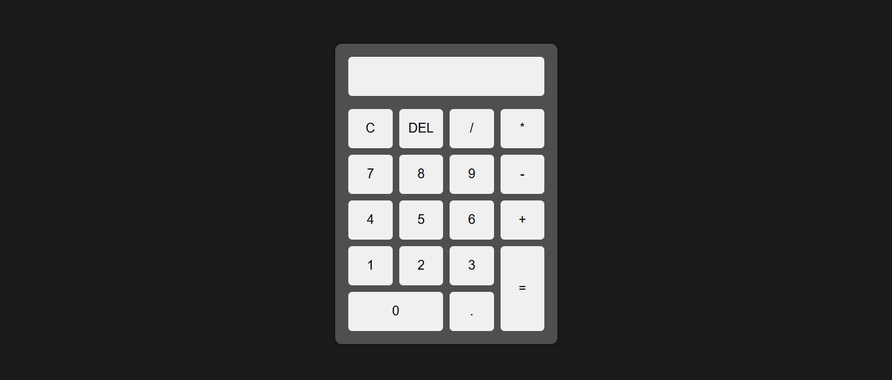

# JavaScript Calculator

A simple calculator built with **HTML**, **CSS**, and **JavaScript**.  
This project was created to practice DOM manipulation and basic programming logic.

## Preview



```md

```

## About the project

This calculator allows the user to perform basic math operations in a clean and responsive interface.

## Features

- Add numbers and operators to the display.
- Delete the last character.
- Clear the entire display.
- Calculate expressions.
- Show results with 2 decimal places.

## Technologies used

- HTML5
- CSS3
- JavaScript

## How it works

The JavaScript code controls the calculator behavior through simple functions:

- `insertDisplay(data)` adds a value to the display.
- `clean()` clears the display.
- `del()` removes the last character.
- `result()` evaluates the expression and shows the result.

## Code example

```js
insertDisplay("5");
insertDisplay("+");
insertDisplay("3");
result();
```

Result:

```txt
8.00
```

## Project structure

```txt
calculator-js/
├── index.html
├── style.css
└── script.js
```

## Note

This project uses `eval()` to calculate expressions.  
It is fine for learning purposes, but for larger projects, a safer approach is recommended.

## Author

Created by [Eric QS Dev](https://github.com/Eric-QS-Dev)
